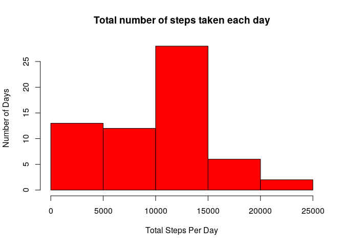
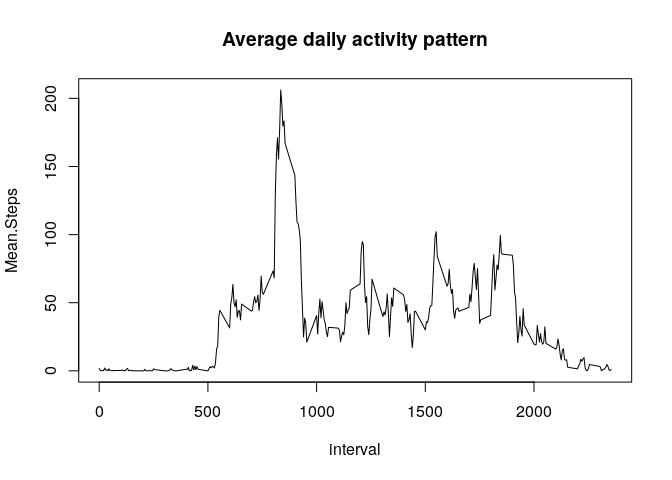
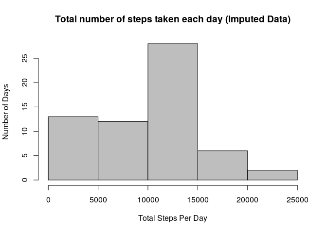
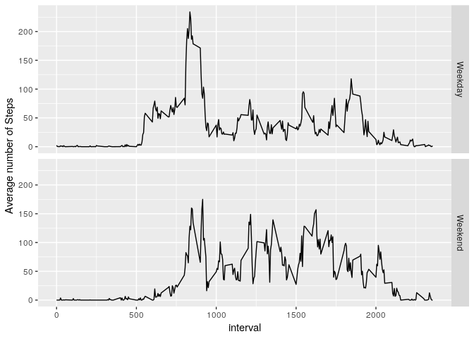

This is the R Markdown document for Peer Assignment 1, Reproducible Research Course.

## Loading and preprocessing the data


```r
  library("ggplot2")
  library("dplyr")
```

```
## 
## Attaching package: 'dplyr'
```

```
## The following objects are masked from 'package:stats':
## 
##     filter, lag
```

```
## The following objects are masked from 'package:base':
## 
##     intersect, setdiff, setequal, union
```

```r
  url <- "https://d396qusza40orc.cloudfront.net/repdata%2Fdata%2Factivity.zip"
  temp1 <- tempfile()
  temp2 <- tempfile()
  
  download.file(url, temp1)
  unzip(zipfile = temp1, exdir = temp2)
  
  repdata <- read.csv2(file.path(temp2, "activity.csv"), header = TRUE, sep = ",", dec = ".", colClasses=c("numeric", "character", "numeric"), na.strings=c("NA"))
  repdata$date <- as.Date(repdata$date) 
```


## What is mean total number of steps taken per day?

```r
  redataAggregate <- repdata %>% 
                      group_by(date) %>% 
                      summarise(Total.Steps = sum(steps, na.rm = TRUE))
  #unique(redataAggregate$Total.Steps)
  hist(redataAggregate$Total.Steps, 
       xlab = "Total Steps Per Day", 
       ylab = "Number of Days",
       main = "Total number of steps taken each day", 
       col = "red")
```

<!-- -->

```r
  #redataAggregate
  
  cat("The mean total number of steps taken per day was: ", mean(redataAggregate$Total.Steps),".")
```

```
## The mean total number of steps taken per day was:  9354.23 .
```

```r
  cat("The median total number of steps taken per day was: ", median(redataAggregate$Total.Steps),".")
```

```
## The median total number of steps taken per day was:  10395 .
```

## What is the average daily activity pattern?

```r
  redataActivity <- as.data.frame(repdata %>% group_by(interval) %>% summarise(Mean.Steps = mean(steps, na.rm = TRUE)))
  #redataActivity
  par(mfrow=c(1, 1))
  plot(redataActivity, type = "l", main = "Average daily activity pattern")
```

<!-- -->

```r
  #Which 5-minute interval, on average across all the days in the dataset, contains the maximum number of steps?
  cat("The 5-minute interval, on average across all the days in the dataset, that contains the maximum number of steps was interval", redataActivity[which.max(redataActivity$Mean.Steps), 1],".")
```

```
## The 5-minute interval, on average across all the days in the dataset, that contains the maximum number of steps was interval 835 .
```

## Imputing missing values

```r
  # Calculate and report the total number of missing values in the dataset (i.e. the total number of rows with NAs)
  cat("The total number of rows with NAs is", sum(is.na(repdata$steps)),".")
```

```
## The total number of rows with NAs is 2304 .
```

```r
    # My strategy for filling in all of the missing values in the dataset is to replace the NA with the median for that 5-minute interval. 
    # Create a new dataset that is equal to the original dataset but with the missing data filled in.
  redataImputed <-  repdata %>% group_by(interval) %>% mutate(steps = ifelse(is.na(steps), median(steps, na.rm = TRUE), steps))
  #as.data.frame(redataImputed)
    # Make a histogram of the total number of steps taken each day and Calculate and report the mean and median total number of steps taken per day. 
  redataImputed2 <- redataImputed %>% group_by(date) %>% summarise(Total.Steps = sum(steps, na.rm = TRUE))
  hist(redataImputed2$Total.Steps, 
       xlab = "Total Steps Per Day", 
       ylab = "Number of Days",
       main = "Total number of steps taken each day (Imputed Data)", 
       col = "gray")
```

<!-- -->

```r
  cat("The mean total number of steps taken per day was: ", mean(redataImputed2$Total.Steps),".")
```

```
## The mean total number of steps taken per day was:  9503.869 .
```

```r
  cat("The median total number of steps taken per day was: ", median(redataImputed2$Total.Steps),".")
```

```
## The median total number of steps taken per day was:  10395 .
```

The mean differs from the estimates in the first part of the assignment.  The impact is that the mean total number of steps taken per day has increased, while the median total number of steps taken per day remains the same.  


## Are there differences in activity patterns between weekdays and weekends?

```r
  #redataActivityWD <- 
  repdata$weekday <- "Weekday"
  repdata$weekday[weekdays(repdata$date) %in% c("Saturday","Sunday")] <- "Weekend"
  repdata$weekday <- as.factor(repdata$weekday)
  p <- repdata %>% 
    group_by(interval, weekday) %>% 
    summarize(avgsteps = mean(steps, na.rm = TRUE))

qplot(x = interval, y = avgsteps, data = p, geom = c("line"), facets = weekday~., ylab = "Average number of Steps")
```

<!-- -->

There is a different pattern of steps for weekdays and weekends. Activity occurs more throughout the day on the weekends, and the time periods are more limited on weekdays. 

